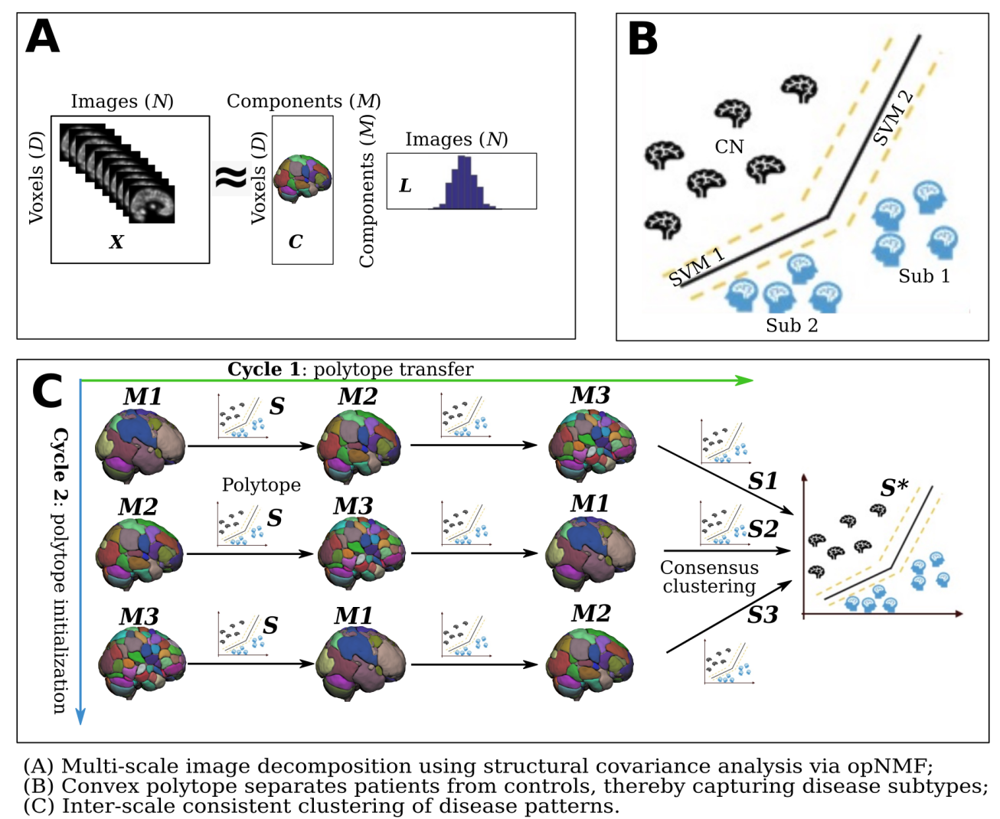

<p align="center">
  
</p>

# MAGIC documentation
**MAGIC**, Multi-scAle heteroGeneity analysIs and Clustering, is a multi-scale semi-supervised clustering method that aims to derive robust clustering solutions across different scales for brain diseases.
Compared to original HYDRA method, MAGIC has the following advantages:
- Multi-scale feature extractions via opNMF;
- Inter-scale consistent clustering solution.

## Installation
### Prerequisites
In order to run MAGIC, one must have already installed and ran [SOPNMF (https://github.com/anbai106/SOPNMF) with the voxel-wise image data. After this, please follow the following steps for installation.

There are three choices to install MAGIC.
### Use MAGIC as a python package
We recommend the users to use Conda virtual environment:
```
1) conda create --name MAGIC python=3.6
```
Activate the virtual environment:
```
2) source activate MAGIC
```
Install other python package dependencies (go to the root folder of MAGIC):
```
3) ./install_requirements.sh
```
Finally, we need install MAGIC from PyPi:
```
3) pip install magiccluster==0.0.3
```

### Use MAGIC from commandline:
After installing all dependencies in the **requirements.txt** file, go to the root folder of MAGIC where the **setup.py** locates:
```
pip install -e .
```

### Use MAGIC as a developer version:
```
python -m pip install git+https://github.com/anbai106/MAGIC.git
```

## Input structure
MAGIC requires a specific input structure inspired by [BIDS](https://bids.neuroimaging.io/).
Some conventions for the group label/diagnosis: -1 represents healthy control (**CN**) and 1 represents patient (**PT**); categorical variables, such as sex, should be encoded to numbers: Female for 0 and Male for 1, for instance.

### participant and covariate tsv
The first 3 columns are **participant_id**, **session_id** and **diagnosis**.

Example for feature tsv:
```
participant_id    session_id    diagnosis
sub-CLNC0001      ses-M00    -1   432.1
sub-CLNC0002      ses-M00    1    398.2
sub-CLNC0003      ses-M00    -1    412.0
sub-CLNC0004      ses-M00    -1    487.4
sub-CLNC0005      ses-M00    1    346.5
sub-CLNC0006      ses-M00    1    443.2
sub-CLNC0007      ses-M00    -1    450.2
sub-CLNC0008      ses-M00    1    443.2
```
Example for covariate tsv:
```
participant_id    session_id    diagnosis    age    sex ...
sub-CLNC0001      ses-M00    -1   56.1    0
sub-CLNC0002      ses-M00    1    57.2    0
sub-CLNC0003      ses-M00    -1    43.0    1
sub-CLNC0004      ses-M00    -1    25.4    1
sub-CLNC0005      ses-M00    1    74.5    1
sub-CLNC0006      ses-M00    1    44.2    0
sub-CLNC0007      ses-M00    -1    40.2    0
sub-CLNC0008      ses-M00    1    43.2    1
```

## Example
We offer a fake dataset in the folder of **MAGIC/data**. Users should follow the same data structure.

### Running MAGIC for clustering CN vs Subtype1 vs Subtype2 vs ...:
```
from from magic.magic_clustering import clustering
participant_tsv="MAGIC/data/participant.tsv"
opnmf_dir = "PATH_OPNMF_DIR"
output_dir = "PATH_OUTPUT_DIR"
k_min=2
k_max=8
cv_repetition=100
clustering(participant_tsv, opnmf_dir, output_dir, k_min, k_max, 25, 60, 5, cv_repetition)
```

## Citing this work
### If you use this software, please cite the following paper:
> Wen J., Varol E., Chand G., Sotiras A., Davatzikos C. (2020) **MAGIC: Multi-scale Heterogeneity Analysis and Clustering for Brain Diseases**. Medical Image Computing and Computer Assisted Intervention – MICCAI 2020. MICCAI 2020. Lecture Notes in Computer Science, vol 12267. Springer, Cham. https://doi.org/10.1007/978-3-030-59728-3_66

> Wen J., Varol E., Chand G., Sotiras A., Davatzikos C. (2022) **Multi-scale semi-supervised clustering of brain images: Deriving disease subtypes**. Medical Image Analysis, 2022. https://doi.org/10.1016/j.media.2021.102304 - [Link](https://www.sciencedirect.com/science/article/pii/S1361841521003492)
